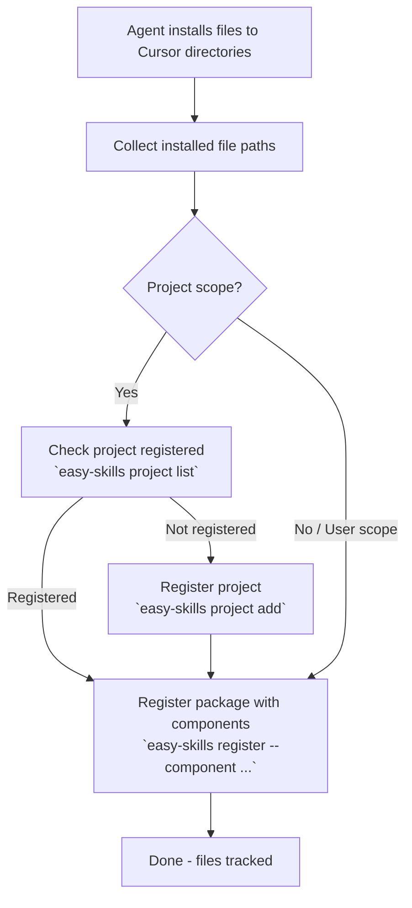

# Easy Skills

Track and manage scattered components (skills, agents, hooks, rules) as logical packages for **Cursor**.

---

## MANDATORY RULE

**ALL installations MUST be registered to easy-skills after files are in place.**

This applies to:
- **Skills** - Agent skill packages
- **Agents** - AI agent configurations
- **Hooks** - Pre/post execution hooks
- **Rules** - Coding rules and patterns
- **Any** files installed to Cursor

---

## Core Concept

A package is a **logical grouping** of scattered files. One package can contain multiple components in different locations:

```
Package "superpowers"
  ├── component: skill → .cursorrules/superpowers/
  ├── component: hook  → .cursorrules/hooks/superpowers-hook/
  └── component: rule  → .cursorrules/rules/superpowers-rule/
```

easy-skills tracks these scattered files so they can be managed (listed, verified, uninstalled) as one unit.

---

## Installation Flow



---

## Step-by-Step Guide

### Step 1: Install Files to Cursor

Install files to their target directories as normal:

```bash
# User scope
~/.cursorrules/<name>/

# Project scope
.cursorrules/<name>/
```

### Step 2: For Project Scope - Check Project Registration

```bash
easy-skills project list

# If not registered:
easy-skills project add --name <project-name> --path /path/to/project
```

### Step 3: Register Package with Components

Register all installed files as one package. Each `--component` specifies `type:name:path`:

```bash
easy-skills register --name <package-name> --target cursor \
  --component "skill:<skill-name>:<installed-path>" \
  --component "hook:<hook-name>:<installed-path>" \
  --component "rule:<rule-name>:<installed-path>"
```

**Component types:** `skill`, `agent`, `hook`, `rule`

**Example:** If you installed a skill to `~/.cursorrules/foo` and a rule to `~/.cursorrules/rules/foo-rule`:

```bash
easy-skills register --name foo --target cursor \
  --component "skill:foo:~/.cursorrules/foo" \
  --component "rule:foo-rule:~/.cursorrules/rules/foo-rule"
```

---

## Command Reference

### Register (track installed files)

```bash
easy-skills register --name <name> --target cursor \
  --component "type:name:path" \
  --component "type:name:path"
```

### Verify (check files still exist)

```bash
easy-skills install --name <name> --target cursor
```

### Uninstall (delete files + remove records)

```bash
easy-skills uninstall --name <name> --target cursor
```

### List & Info

```bash
easy-skills list --target cursor
easy-skills info --name <name> --target cursor
easy-skills status --ide cursor
```

### Project Management

```bash
easy-skills project list
easy-skills project add --name <name> --path <path>
easy-skills project remove --name <name>
```

---

## Output Format

```json
{
  "success": true,
  "data": {...}
}
```

On error:

```json
{
  "success": false,
  "error": "error message"
}
```

---

## Web UI

View status at: http://localhost:27842

Start server: `easy-skills serve`
